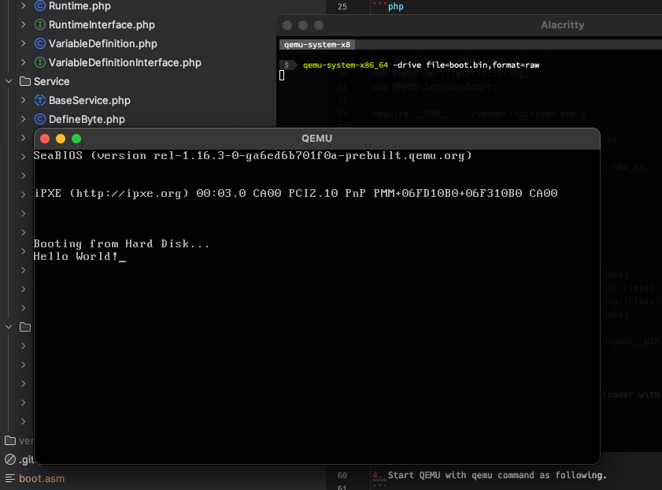

# PHP-OS

The PHP-OS is implemented an Operating System written in PHP.
This is **not an emulator** for architectures; for example. i386, x86_64 and so on.
This project makes an assembly or image file directly for an operating system.

Moreover, this is very ultra hyper maximum experimental implementation.

## Requirements

- PHP 8.3+
- qemu
- nasm

## Notice

In currently status, this project only implements  **Intel x86_64** architecture.
But you can try this architecture with using QEMU on aarch (macOS M1, M2).

## Quick Start

1. Install PHP-OS via composer.

```
$ composer require m3m0r7/php-os
```

2. Write an example code as `HelloWorld.php` as following.

```php
<?php

require __DIR__ . '/vendor/autoload.php';

$bootloader = new \PHPOS\Bootloader\Bootloader(
    new \PHPOS\Architecture\Architecture(
        // Use x86_64 architecture
        \PHPOS\Architecture\ArchitectureType::x86_64,
    ),
    new \PHPOS\Bootloader\Option(
        new \PHPOS\Bootloader\IO(),
    ),
);

// Set variable for printing BIOS screen
$bootloader->architecture()->runtime()
    ->setVariable('hello_world', 'Hello World!');

// Initialize bootloader
$bootloader
    // Print Hello World into BIOS screen
    ->registerInitializationService(\PHPOS\Service\HelloWorld::class)

    // Enable Print String service
    ->registerInitializationService(\PHPOS\Service\PrintString::class)

    // Fill with null to 510 bytes and add magic bytes into last in bootloader
    ->registerPostService(\PHPOS\Service\EndOfBootLoader::class)

    // Bridge to assembler
    ->assemble()

    // Save as a boot.asm file
    ->saveAsReadable(
        // Specify save path
        new \PHPOS\Stream\File(fopen(__DIR__ . '/boot.asm', 'w+')),

        // Or save to on-memory.
        // new \PHPOS\Stream\Memory(),
    );
```

3. Make `boot.bin` as an image file for bootloader with nasm command as following.

```
$ nasm -f bin boot.asm -o boot.bin
```

4. Start QEMU with qemu command as following.
```
$ qemu-system-x86_64 -drive file=boot.bin,format=raw
```

5. Show figure as following if you successfully to run the QEMU.




The quick start example will generate a `boot.asm` as following:
```asm
;
;                                  _     _          __             _____  _    _ _____         ____   _____
;     /\                          | |   | |        / _|           |  __ \| |  | |  __ \       / __ \ / ____|
;    /  \   ___ ___  ___ _ __ ___ | |__ | |_   _  | |_ ___  _ __  | |__) | |__| | |__) |_____| |  | | (___
;   / /\ \ / __/ __|/ _ \ '_ ` _ \| '_ \| | | | | |  _/ _ \| '__| |  ___/|  __  |  ___/______| |  | |\___ \
;  / ____ \__ \__ \  __/ | | | | | |_) | | |_| | | || (_) | |    | |    | |  | | |          | |__| |____) |
; /_/    \_\___/___/\___|_| |_| |_|_.__/|_|\__, | |_| \___/|_|    |_|    |_|  |_|_|           \____/|_____/
;                                           __/ |
;                                          |___/
;
; Notice: This file is automatically generated by PHP-OS.
;         Do not edit this file. We cannot be held responsible if this is edited and overwritten again.
;

start:
  jmp main
main:
  mov ax, 0x07C0
  mov ds, ax
  mov es, ax
  mov si, hello_world
  call __php_PHPOS_Service_PrintString

__php_PHPOS_Service_PrintString_PHPOS_Service_Return_:
  ret
__php_PHPOS_Service_PrintString_PHPOS_Service_PrintCharacter:
  mov ah, 0x0E
  int 0x10
  ret
__php_PHPOS_Service_PrintString:
  lodsb
  or al, al
  jz __php_PHPOS_Service_PrintString_PHPOS_Service_Return_
  call __php_PHPOS_Service_PrintString_PHPOS_Service_PrintCharacter
  jmp __php_PHPOS_Service_PrintString

hello_world:
  db "Hello World!", 0

times 510-($-$$) db 0
db 0x55
db 0xAA
```

## Test

```
$ ./vendor/bin/phpunit tests/
```

## Linting

```
$ ./vendor/bin/php-cs-fixer fix src/ tests/
```

## License

MIT
