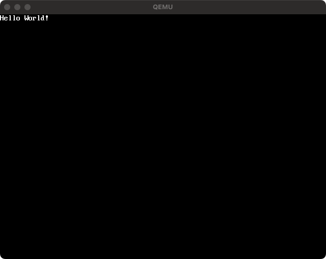

# PHP-OS

The PHP-OS is implemented an Operating System written in PHP.
This is **not an emulator** for architectures; for example. i386, x86_64 and so on.
This project makes an assembly or image file directly for an operating system.

Moreover, this is very ultra hyper maximum experimental implementation.

## Requirements

- PHP 8.3+
- qemu
- nasm
- make

## Notice

In currently status, this project only implements  **Intel x86_64** architecture.
But you can try this architecture with using QEMU on aarch (macOS M1, M2).

## Screenshot

<p align="center">
  
</p>


## Quick Start

1. Install PHP-OS via composer.

```
$ composer require m3m0r7/php-os
```

2. Write an example code as `HelloWorld.php` as following.

```php
<?php

require __DIR__ . '/vendor/autoload.php';

$bootloader = new \PHPOS\OS\Code(
    new \PHPOS\Architecture\Architecture(
    // Use x86_64 architecture
        \PHPOS\Architecture\ArchitectureType::x86_64,
    ),
);

// Initialize bootloader
$bootloader
    // Set 16 bit real mode
    ->setBits(\PHPOS\OS\BitType::BIT_16)

    // Set bootloader origin
    ->setOrigin(\PHPOS\OS\OSInfo::MBR)

    // Print Hello World into BIOS screen
    ->registerService(\PHPOS\Service\Kit\Startup\HelloWorld::class)

    // Add bootloader signature
    ->registerPostService(\PHPOS\Service\BIOS\Bootloader\BootloaderSignature::class);

// Bundle the code into an OS image
$bundler = new \PHPOS\OS\Bundler\Bundler(
    new \PHPOS\OS\ConfigureOption(
        __DIR__ . '/dist',
        'php-os.img',
        $bootloader,
    ),
);

// Distribute Makefile and assembly into `dist` directory by the ConfigureOption
$bundler->distribute();

```

3. Make with NASM instructions and build an OS image as following.

```
$ cd dist && make clean && make all
```

4. Start QEMU with qemu command as following.
```
$ qemu-system-x86_64 -drive file=./dist/build/php-os.img,format=raw
```

5. Show figure as following if you successfully to run the QEMU.

<p align="center">
  
</p>


The quick start example will generate an assembly file as following:
```asm
;
;   _______  ____  ____  _______            ___     ______
;  |_   __ \|_   ||   _||_   __ \         .'   `. .' ____ \
;    | |__) | | |__| |    | |__) |______ /  .-.  \| (___ \_|
;    |  ___/  |  __  |    |  ___/|______|| |   | | _.____`.
;   _| |_    _| |  | |_  _| |_           \  `-'  /| \____) |
;  |_____|  |____||____||_____|           `.___.'  \______.'
;
; Notice: This file is automatically generated by PHP-OS.
;         Do not edit this file. We cannot be held responsible if this is edited and overwritten again.
;


[bits 16]

[org 0x7c00]

main:
  cli
  xor ax, ax
  xor bx, bx
  mov ds, ax
  mov es, ax
  mov ss, ax
  mov sp, 31744
  sti
mov esi, __php_var_SGVsbG8gV29ybGQh
call __php_PHPOS_Service_BIOS_IO_PrintConstantString
jmp __php_PHPOS_Service_BIOS_IO_PrintConstantString_PHPOS_Service_BIOS_IO_PrintConstantString_PrintDone
__php_PHPOS_Service_BIOS_IO_PrintConstantString_PHPOS_Service_BIOS_IO_PrintConstantString_PrintCharacter:
  mov ah, 14
  mov ebx, 15
  int 16
  ret
__php_PHPOS_Service_BIOS_IO_PrintConstantString:
  lodsb
  or al, al
  jz __php_PHPOS_Service_BIOS_IO_PrintConstantString_PHPOS_Service_BIOS_IO_PrintConstantString_PrintDone
  call __php_PHPOS_Service_BIOS_IO_PrintConstantString_PHPOS_Service_BIOS_IO_PrintConstantString_PrintCharacter
  jmp __php_PHPOS_Service_BIOS_IO_PrintConstantString
__php_PHPOS_Service_BIOS_IO_PrintConstantString_PHPOS_Service_BIOS_IO_PrintConstantString_PrintDone:
  ret
hlt

__php_var_SGVsbG8gV29ybGQh:
  db "Hello World!", 0

times 510-($-$$) db 0
dw 0xAA55
```

### Use VESA BIOS Extension

#### Render a text
```php
<?php

use PHPOS\OS\CodeInfo;

require __DIR__ . '/vendor/autoload.php';

//
// Create kernel -----------------------------------------------------------------------------
//

$kernel = new \PHPOS\OS\Code(
    new \PHPOS\Architecture\Architecture(
        // Use x86_64 architecture
        \PHPOS\Architecture\ArchitectureType::x86_64,
    ),
);

$image = new \PHPOS\Service\Component\Image\Image(
    // NOTE: Specify if you want to render an image path
    //       Only available the file size belows 4KB.
    __DIR__ . '/doc/logo.png',
);
$kernel
    // Set code name
    ->setName('kernel')

    // Set 16 bit real mode
    ->setBits(\PHPOS\OS\BitType::BIT_16)

    // Set kernel origin
    ->setOrigin(0x1000)

    // Set compiled kernel size (floor(filesize / 512))
    ->setSectors((int) floor(CodeInfo::CODE_BLOCK_SIZE_BITS_16 / \PHPOS\OS\OSInfo::PAGE_SIZE))

    // Load VESA BIOS Extension
    ->registerService(\PHPOS\Service\BIOS\Standard\Segment\SetupSegments::class)
    ->registerService(\PHPOS\Service\BIOS\VESABIOSExtension\SetVESABIOSExtension::class)
    ->registerService(\PHPOS\Service\BIOS\VESABIOSExtension\SetVESABIOSExtensionInformation::class)
    ->registerService(\PHPOS\Service\BIOS\VESABIOSExtension\LoadVESAVideoAddress::class)

    // Print "Hello World!" into VESA
    ->registerService(\PHPOS\Service\BIOS\IO\PrintConstantString::class, 'Hello World!')

    // Write code signature
    ->registerPostService(\PHPOS\Service\BIOS\Disk\CodeSignature::class);

//
// Create bootloader --------------------------------------------------------------------------
//

$bootloader = new \PHPOS\OS\Code(
    new \PHPOS\Architecture\Architecture(
        // Use x86_64 architecture
        \PHPOS\Architecture\ArchitectureType::x86_64,
    ),
);

// Initialize bootloader
$bootloader
    // Set code name
    ->setName('bootloader')

    // Set 16 bit real mode
    ->setBits(\PHPOS\OS\BitType::BIT_16)

    // Set bootloader origin
    ->setOrigin(\PHPOS\OS\OSInfo::MBR)

    // Setup segments (initialize registers for assembly)
    ->registerService(\PHPOS\Service\BIOS\Standard\Segment\SetupSegments::class)

    // Add loading something sector codes
    ->registerService(\PHPOS\Service\BIOS\System\CallCode::class, $kernel)

    // Add bootloader signature
    ->registerPostService(\PHPOS\Service\BIOS\Bootloader\BootloaderSignature::class);

// Bundle each codes into an OS image
$bundler = new \PHPOS\OS\Bundler\Bundler(
    new \PHPOS\OS\ConfigureOption(
        __DIR__ . '/dist',
        'php-os.img',
        $bootloader,
        [
            $kernel,
        ],
    ),
);

// Distribute Makefile and assembly into `dist` directory by the ConfigureOption
$bundler->distribute();
```

<p align="center">
  
</p>


#### Render an image from inline
```php
<?php

use PHPOS\OS\CodeInfo;

require __DIR__ . '/vendor/autoload.php';

//
// Create kernel -----------------------------------------------------------------------------
//

$kernel = new \PHPOS\OS\Code(
    new \PHPOS\Architecture\Architecture(
        // Use x86_64 architecture
        \PHPOS\Architecture\ArchitectureType::x86_64,
    ),
);

$image = new \PHPOS\Service\Component\Image\Image(
    // NOTE: Specify if you want to render an image path
    //       Only available the file size belows 4KB.
    __DIR__ . '/doc/logo.png',
);
$kernel
    // Set code name
    ->setName('kernel')

    // Set 16 bit real mode
    ->setBits(\PHPOS\OS\BitType::BIT_16)

    // Set kernel origin
    ->setOrigin(0x1000)

    // Set compiled kernel size (floor(filesize / 512))
    ->setSectors(floor(CodeInfo::CODE_BLOCK_SIZE_BITS_16 / \PHPOS\OS\OSInfo::PAGE_SIZE))

    // Load VESA BIOS Extension
    ->registerService(\PHPOS\Service\BIOS\Standard\Segment\SetupSegments::class)
    ->registerService(\PHPOS\Service\BIOS\VESABIOSExtension\SetVESABIOSExtension::class)
    ->registerService(\PHPOS\Service\BIOS\VESABIOSExtension\SetVESABIOSExtensionInformation::class)
    ->registerService(\PHPOS\Service\BIOS\VESABIOSExtension\LoadVESAVideoAddress::class)

    // Set render position
    ->registerService(
        \PHPOS\Service\BIOS\VESABIOSExtension\Renderer\SetRenderPosition::class,
        $image->width(),
        $image->height(),
        \PHPOS\Service\Component\VESA\AlignType::CENTER_CENTER,
    )

    // Render an image
    ->registerService(
        \PHPOS\Service\BIOS\VESABIOSExtension\Renderer\RenderImageFromInline::class,
        $image,
    )

    // Write code signature
    ->registerPostService(\PHPOS\Service\BIOS\Disk\CodeSignature::class);

//
// Create bootloader --------------------------------------------------------------------------
//

$bootloader = new \PHPOS\OS\Code(
    new \PHPOS\Architecture\Architecture(
        // Use x86_64 architecture
        \PHPOS\Architecture\ArchitectureType::x86_64,
    ),
);

// Initialize bootloader
$bootloader
    // Set code name
    ->setName('bootloader')

    // Set 16 bit real mode
    ->setBits(\PHPOS\OS\BitType::BIT_16)

    // Set bootloader origin
    ->setOrigin(\PHPOS\OS\OSInfo::MBR)

    // Setup segments (initialize registers for assembly)
    ->registerService(\PHPOS\Service\BIOS\Standard\Segment\SetupSegments::class)

    // Add loading something sector codes
    ->registerService(\PHPOS\Service\BIOS\System\CallCode::class, $kernel)

    // Add bootloader signature
    ->registerPostService(\PHPOS\Service\BIOS\Bootloader\BootloaderSignature::class);

// Bundle each codes into an OS image
$bundler = new \PHPOS\OS\Bundler\Bundler(
    new \PHPOS\OS\ConfigureOption(
        __DIR__ . '/dist',
        'php-os.img',
        $bootloader,
        [
            $kernel,
        ],
    ),
);

// Distribute Makefile and assembly into `dist` directory by the ConfigureOption
$bundler->distribute();
```

<p align="center">
  
</p>


### See examples

- [Call a code in something sector](doc/example/01-call-code-in-something-sector/README.md)
- [Render a square using VESA](doc/example/02-render-a-square-using-vesa/README.md)
- [Render an image from disk using VESA](doc/example/03-render-an-image-from-disk-using-vesa/README.md)
- [Enable A20 line and Transit to 32-bit mode](doc/example/04-enable-a20-line-and-transit-to-32bit-mode/README.md)

## Test

```
$ ./vendor/bin/phpunit tests/
```

## Code formatting

```
$ ./vendor/bin/php-cs-fixer fix src/
$ ./vendor/bin/php-cs-fixer fix tests/
```

## License

MIT
