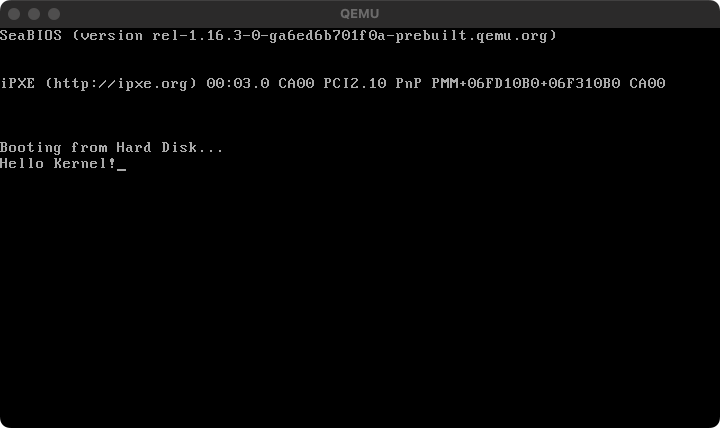

# Call a code in something sector

The bootloader is typically limited to 512 bytes. Therefore, it needs to move to other sectors on the disk to implement the kernel or other components.
The PHP-OS provides the functionality to move to other sectors and call the specified code. The following example demonstrates how to write simple code that outputs `Hello Kernel!` from the code stored in disk sector 2.
Since the bootloader depends on the code stored in sector 2, you must be careful when passing the list of codes to be bundled as the third parameter when executing `Bundler`.


```php
<?php

use PHPOS\OS\CodeInfo;

require __DIR__ . '/vendor/autoload.php';

//
// Create kernel -----------------------------------------------------------------------------
//

$kernel = new \PHPOS\OS\Code(
    new \PHPOS\Architecture\Architecture(
        // Use x86_64 architecture
        \PHPOS\Architecture\ArchitectureType::x86_64,
    ),
);

// Kernel
$kernel
    // Set code name
    ->setName('kernel')

    // Set 16 bit real mode
    ->setBits(\PHPOS\OS\BitType::BIT_16)

    // Set kernel origin
    ->setOrigin(0x1000)

    // Set install sector. Default is 2 or greater.
    ->setSector(2)

    // Set compiled kernel size (floor(filesize / 512))
    ->setSectors(floor(CodeInfo::CODE_BLOCK_SIZE_BITS_16 / \PHPOS\OS\OSInfo::PAGE_SIZE))

    // Print Hello World into BIOS screen
    ->registerService(\PHPOS\Service\Kit\Startup\HelloWorld::class, 'Hello Kernel!')

    // Write code signature
    ->registerPostService(\PHPOS\Service\BIOS\Disk\CodeSignature::class);

//
// Create bootloader --------------------------------------------------------------------------
//

$bootloader = new \PHPOS\OS\Code(
    new \PHPOS\Architecture\Architecture(
        // Use x86_64 architecture
        \PHPOS\Architecture\ArchitectureType::x86_64,
    ),
);

// Initialize bootloader
$bootloader
    // Set code name
    ->setName('bootloader')

    // Set 16 bit real mode
    ->setBits(\PHPOS\OS\BitType::BIT_16)

    // Set bootloader origin
    ->setOrigin(\PHPOS\OS\OSInfo::MBR)

    // Setup segments (initialize registers for assembly)
    ->registerService(\PHPOS\Service\BIOS\Standard\Segment\SetupSegments::class)

    // Add loading something sector codes
    ->registerService(\PHPOS\Service\BIOS\System\CallCode::class, $kernel)

    // Add bootloader signature
    ->registerPostService(\PHPOS\Service\BIOS\Bootloader\BootloaderSignature::class);

// Bundle each codes into an OS image
$bundler = new \PHPOS\OS\Bundler\Bundler(
    new \PHPOS\OS\ConfigureOption(
        __DIR__ . '/dist',
        'php-os.img',
        [
            $bootloader,
            $kernel,
        ],
    ),
);

// Distribute Makefile and assembly into `dist` directory by the ConfigureOption
$bundler->distribute();

```

## Generated `bootloader.asm`

```asm
;
;   _______  ____  ____  _______            ___     ______
;  |_   __ \|_   ||   _||_   __ \         .'   `. .' ____ \
;    | |__) | | |__| |    | |__) |______ /  .-.  \| (___ \_|
;    |  ___/  |  __  |    |  ___/|______|| |   | | _.____`.
;   _| |_    _| |  | |_  _| |_           \  `-'  /| \____) |
;  |_____|  |____||____||_____|           `.___.'  \______.'
;
; Notice: This file is automatically generated by PHP-OS.
;         Do not edit this file. We cannot be held responsible if this is edited and overwritten again.
;

%define __php_define_kernel_sector 2
%define __php_define_kernel_sectors 64
%define __php_define_kernel_head 0
%define __php_define_kernel_drive 128

[bits 16]

[org 0x7c00]

cli
xor ax, ax
xor bx, bx
mov ds, ax
mov es, ax
mov ss, ax
mov sp, 31744

__php_PHPOS_Service_BIOS_System_CallCode:
    __php_PHPOS_Service_BIOS_Disk_LoadSector:
      mov bx, 4096
      mov ah, 0x0002
      mov al, __php_define_kernel_sectors
      mov ch, 0x0000
      mov cl, __php_define_kernel_sector
      mov dh, __php_define_kernel_head
      mov dl, __php_define_kernel_drive
      int 19
      jc __php_PHPOS_Service_BIOS_Disk_DiskError
      jmp __php_PHPOS_Service_BIOS_Disk_LoadSector_finish
      ret
      __php_PHPOS_Service_BIOS_Disk_DiskError:
        mov si, __php_var_TG9hZCBkaXNrIGVycm9yIQ__
        call __php_PHPOS_Service_BIOS_IO_PrintString
        jmp __php_PHPOS_Service_BIOS_IO_PrintString_PHPOS_Service_BIOS_IO_PrintDone
        __php_PHPOS_Service_BIOS_IO_PrintString_PHPOS_Service_BIOS_IO_PrintCharacter:
          mov ah, 0x000E
          int 16
          ret
        __php_PHPOS_Service_BIOS_IO_PrintString:
          lodsb
          or al, al
          jz __php_PHPOS_Service_BIOS_IO_PrintString_PHPOS_Service_BIOS_IO_PrintDone
          call __php_PHPOS_Service_BIOS_IO_PrintString_PHPOS_Service_BIOS_IO_PrintCharacter
          jmp __php_PHPOS_Service_BIOS_IO_PrintString
          __php_PHPOS_Service_BIOS_IO_PrintString_PHPOS_Service_BIOS_IO_PrintDone:
            ret
        hlt
    __php_PHPOS_Service_BIOS_Disk_LoadSector_finish:
  jmp 0x1000

__php_var_TG9hZCBkaXNrIGVycm9yIQ__:
  db "Load disk error!", 0

times 510-($-$$) db 0
dw 0xAA55
```

## Generated `kernel.asm`

```asm
;
;   _______  ____  ____  _______            ___     ______
;  |_   __ \|_   ||   _||_   __ \         .'   `. .' ____ \
;    | |__) | | |__| |    | |__) |______ /  .-.  \| (___ \_|
;    |  ___/  |  __  |    |  ___/|______|| |   | | _.____`.
;   _| |_    _| |  | |_  _| |_           \  `-'  /| \____) |
;  |_____|  |____||____||_____|           `.___.'  \______.'
;
; Notice: This file is automatically generated by PHP-OS.
;         Do not edit this file. We cannot be held responsible if this is edited and overwritten again.
;


[bits 16]

[org 0x1000]

main:
  cli
  xor ax, ax
  xor bx, bx
  mov ds, ax
  mov es, ax
  mov ss, ax
  mov sp, 4096
  mov si, __php_var_SGVsbG8gS2VybmVsIQ__
  call __php_PHPOS_Service_BIOS_IO_PrintString
  jmp __php_PHPOS_Service_BIOS_IO_PrintString_PHPOS_Service_BIOS_IO_PrintDone
  __php_PHPOS_Service_BIOS_IO_PrintString_PHPOS_Service_BIOS_IO_PrintCharacter:
    mov ah, 0x000E
    int 16
    ret
  __php_PHPOS_Service_BIOS_IO_PrintString:
    lodsb
    or al, al
    jz __php_PHPOS_Service_BIOS_IO_PrintString_PHPOS_Service_BIOS_IO_PrintDone
    call __php_PHPOS_Service_BIOS_IO_PrintString_PHPOS_Service_BIOS_IO_PrintCharacter
    jmp __php_PHPOS_Service_BIOS_IO_PrintString
    __php_PHPOS_Service_BIOS_IO_PrintString_PHPOS_Service_BIOS_IO_PrintDone:
      ret
  hlt

__php_var_SGVsbG8gS2VybmVsIQ__:
  db "Hello Kernel!", 0

times 32768-($-$$) db 0
```

### Screenshot


