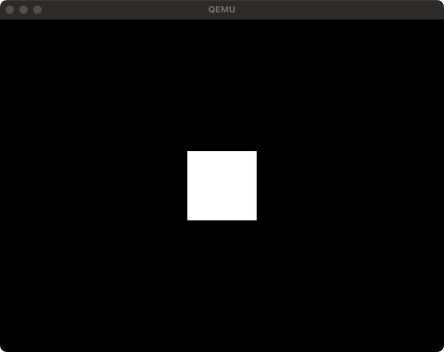

# Render a square using VESA

It is about VESA (Video Electronics Standards Association), and based on this standard, pixels are rendered one by one.
In the example of displaying a rectangle, using VBE (VESA BIOS Extension), which is an extension of the BIOS, you write to memory with the specified RGBA.
If you want to write an image, please refer to the [README.md](../../../) at the top of the repository.


```php
<?php

use PHPOS\OS\CodeInfo;

require __DIR__ . '/vendor/autoload.php';

//
// Create kernel -----------------------------------------------------------------------------
//

$kernel = new \PHPOS\OS\Code(
    new \PHPOS\Architecture\Architecture(
        // Use x86_64 architecture
        \PHPOS\Architecture\ArchitectureType::x86_64,
    ),
);

$width = 100;
$height = 100;

$kernel
    // Set code name
    ->setName('kernel')

    // Set 16 bit real mode
    ->setBits(\PHPOS\OS\BitType::BIT_16)

    // Set kernel origin
    ->setOrigin(0x1000)

    // Set compiled kernel size (floor(filesize / 512))
    ->setSectors(floor(CodeInfo::CODE_BLOCK_SIZE_BITS_16 / \PHPOS\OS\OSInfo::PAGE_SIZE))

    // Load VESA Bios Extension
    ->registerService(\PHPOS\Service\BIOS\Standard\Segment\SetupSegments::class)
    ->registerService(\PHPOS\Service\BIOS\VESABIOSExtension\SetVESABIOSExtension::class)
    ->registerService(\PHPOS\Service\BIOS\VESABIOSExtension\SetVESABIOSExtensionInformation::class)
    ->registerService(\PHPOS\Service\BIOS\VESABIOSExtension\LoadVESAVideoAddress::class)

    // Set render position
    ->registerService(
        \PHPOS\Service\BIOS\VESABIOSExtension\Renderer\SetRenderPosition::class,
        $width,
        $height,
        \PHPOS\Service\Component\VESA\AlignType::CENTER_CENTER,
    )
    ->registerService(\PHPOS\Service\BIOS\VESABIOSExtension\Renderer\RenderSquare::class, $width, $height)

    // Write code signature
    ->registerPostService(\PHPOS\Service\BIOS\Disk\CodeSignature::class);

//
// Create bootloader --------------------------------------------------------------------------
//

$bootloader = new \PHPOS\OS\Code(
    new \PHPOS\Architecture\Architecture(
        // Use x86_64 architecture
        \PHPOS\Architecture\ArchitectureType::x86_64,
    ),
);

// Initialize bootloader
$bootloader
    // Set code name
    ->setName('bootloader')

    // Set 16 bit real mode
    ->setBits(\PHPOS\OS\BitType::BIT_16)

    // Set bootloader origin
    ->setOrigin(\PHPOS\OS\OSInfo::MBR)

    // Setup segments (initialize registers for assembly)
    ->registerService(\PHPOS\Service\BIOS\Standard\Segment\SetupSegments::class)

    // Add loading something sector codes
    ->registerService(\PHPOS\Service\BIOS\System\CallCode::class, $kernel)

    // Add bootloader signature
    ->registerPostService(\PHPOS\Service\BIOS\Bootloader\BootloaderSignature::class);

// Bundle each codes into an OS image
$bundler = new \PHPOS\OS\Bundler\Bundler(
    new \PHPOS\OS\ConfigureOption(
        __DIR__ . '/dist',
        'php-os.img',
        $bootloader,
        [
            $kernel,
        ],
    ),
);

// Distribute Makefile and assembly into `dist` directory by the ConfigureOption
$bundler->distribute();


```

## Generated `bootloader.asm`

- See: [Call code in something sector](../01-call-code-in-something-sector/README.md)

## Generated `kernel.asm`

```asm
;
;   _______  ____  ____  _______            ___     ______
;  |_   __ \|_   ||   _||_   __ \         .'   `. .' ____ \
;    | |__) | | |__| |    | |__) |______ /  .-.  \| (___ \_|
;    |  ___/  |  __  |    |  ___/|______|| |   | | _.____`.
;   _| |_    _| |  | |_  _| |_           \  `-'  /| \____) |
;  |_____|  |____||____||_____|           `.___.'  \______.'
;
; Notice: This file is automatically generated by PHP-OS.
;         Do not edit this file. We cannot be held responsible if this is edited and overwritten again.
;


[bits 16]

[org 0x1000]

cli
xor ax, ax
xor bx, bx
mov ds, ax
mov es, ax
mov ss, ax
mov sp, 4096
sti

__php_PHPOS_Service_BIOS_VESABIOSExtension_SetVESABIOSExtension:
  mov eax, 20226
  mov ebx, 16658
  int 16

__php_PHPOS_Service_BIOS_VESABIOSExtension_SetVESABIOSExtensionInformation:
  mov eax, 20225
  mov ecx, 16658
  mov edi, resb_PHPOS_Service_BIOS_VESABIOSExtension_SetVESABIOSExtensionInformation
  int 16

__php_PHPOS_Service_BIOS_VESABIOSExtension_LoadVESAVideoAddress:
  mov eax, [resb_PHPOS_Service_BIOS_VESABIOSExtension_SetVESABIOSExtensionInformation + 40]
  mov edi, eax

add edi, 365610

__php_PHPOS_Service_BIOS_VESABIOSExtension_Renderer_Renderer:
  mov ecx, 100
__php_PHPOS_Service_BIOS_VESABIOSExtension_Renderer_Renderer_outer:
  push ecx
  mov ecx, 100
__php_PHPOS_Service_BIOS_VESABIOSExtension_Renderer_Renderer_inner:
  __php_PHPOS_Service_BIOS_VESABIOSExtension_Renderer_Renderer_inner_code:
    mov dword [edi], 0xFFFFFF
    add edi, 3
  loop __php_PHPOS_Service_BIOS_VESABIOSExtension_Renderer_Renderer_inner
  pop ecx
  add edi, 1620
loop __php_PHPOS_Service_BIOS_VESABIOSExtension_Renderer_Renderer_outer

resb_PHPOS_Service_BIOS_VESABIOSExtension_SetVESABIOSExtensionInformation: resb 256
times 32768-($-$$) db 0

```

### Screenshot

<p align="center">
  
</p>
