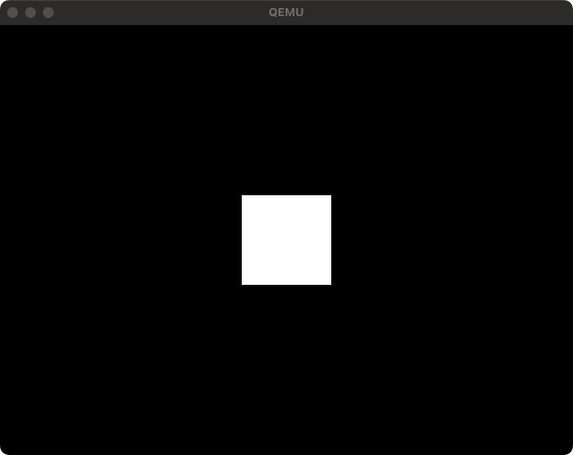

# Render an image from disk using VESA

When reading images from a disk, although more complex code is required to compared to [embedding images inline](../02-render-a-square-using-vesa/README.md) in the assembly, it allows for the use of more storage capacity for images.
When rendering 24-bit (RRGGBB) images, 3 bytes of information are needed per pixel. Therefore, three times the capacity of the image file size is required. For example, if the image dimensions are 200x80, a total of 200x80x3=48KB will be needed.
Embedding images in the assembly also means that the capacity required for other instruction sets must be included, limiting the size of images that can be stored. Above all, it is difficult to estimate how much size can be accommodated.
Reading images from a disk makes estimation easier and allows for more storage capacity than usual.

```php
<?php

use PHPOS\OS\CodeInfo;

require __DIR__ . '/vendor/autoload.php';

//
// Embed Logo -----------------------------------------------------------------------------
//

$logo = new \PHPOS\Service\Component\Image\Image(
    // NOTE: Specify if you want to render an image path
    //       Only available the file size belows 140 * 56 dimenstions below.
    __DIR__ . '/doc/logo.png',
);

$image = new \PHPOS\OS\ImageCode(
    $logo,
    new \PHPOS\Architecture\Architecture(
        // Use x86_64 architecture
        \PHPOS\Architecture\ArchitectureType::x86_64,
    ),
);

$image
    ->setName('image')

    // Set 16 bit real mode
    ->setBits(\PHPOS\OS\BitType::BIT_16)

    // Set image origin
    ->setOrigin(0x3000)

    // Set compiled image size (floor(filesize / 512))
    ->setSectors((int) floor(CodeInfo::CODE_BLOCK_SIZE_BITS_16 / \PHPOS\OS\OSInfo::PAGE_SIZE));

//
// Create kernel -----------------------------------------------------------------------------
//

$kernel = new \PHPOS\OS\Code(
    new \PHPOS\Architecture\Architecture(
        // Use x86_64 architecture
        \PHPOS\Architecture\ArchitectureType::x86_64,
    ),
);

$kernel
    // Set code name
    ->setName('kernel')

    // Set 16 bit real mode
    ->setBits(\PHPOS\OS\BitType::BIT_16)

    // Set kernel origin
    ->setOrigin(0x1000)

    // Set compiled kernel size (floor(filesize / 512))
    ->setSectors(floor(CodeInfo::CODE_BLOCK_SIZE_BITS_16 / \PHPOS\OS\OSInfo::PAGE_SIZE))

    // Load VESA Bios Extension
    ->registerService(\PHPOS\Service\BIOS\Standard\Segment\SetupSegments::class)
    ->registerService(\PHPOS\Service\BIOS\VESABIOSExtension\SetVESABIOSExtension::class)
    ->registerService(\PHPOS\Service\BIOS\VESABIOSExtension\SetVESABIOSExtensionInformation::class)
    ->registerService(\PHPOS\Service\BIOS\VESABIOSExtension\LoadVESAVideoAddress::class)


    // Set render position
    ->registerService(
        \PHPOS\Service\BIOS\VESABIOSExtension\Renderer\SetRenderPosition::class,
        $logo->width(),
        $logo->height(),
        \PHPOS\Service\Component\VESA\AlignType::CENTER_CENTER,
    )

    ->registerService(\PHPOS\Service\BIOS\VESABIOSExtension\Renderer\RenderImageFromDisk::class, $image)

    // Write code signature
    ->registerPostService(\PHPOS\Service\BIOS\Disk\CodeSignature::class);

//
// Create bootloader --------------------------------------------------------------------------
//

$bootloader = new \PHPOS\OS\Code(
    new \PHPOS\Architecture\Architecture(
        // Use x86_64 architecture
        \PHPOS\Architecture\ArchitectureType::x86_64,
    ),
);

// Initialize bootloader
$bootloader
    // Set code name
    ->setName('bootloader')

    // Set 16 bit real mode
    ->setBits(\PHPOS\OS\BitType::BIT_16)

    // Set bootloader origin
    ->setOrigin(\PHPOS\OS\OSInfo::MBR)

    // Setup segments (initialize registers for assembly)
    ->registerService(\PHPOS\Service\BIOS\Standard\Segment\SetupSegments::class)

    // Add loading something sector codes
    ->registerService(\PHPOS\Service\BIOS\System\CallCode::class, $kernel)

    // Add bootloader signature
    ->registerPostService(\PHPOS\Service\BIOS\Bootloader\BootloaderSignature::class);

// Bundle each codes into an OS image
$bundler = new \PHPOS\OS\Bundler\Bundler(
    new \PHPOS\OS\ConfigureOption(
        __DIR__ . '/dist',
        'php-os.img',
        $bootloader,
        [
            $kernel,
            $image,
        ],
    ),
);

// Distribute Makefile and assembly into `dist` directory by the ConfigureOption
$bundler->distribute();

```

## Generated `bootloader.asm`

- See: [Call code in something sector](../01-call-code-in-something-sector/README.md)

## Generated `kernel.asm`

```asm
;
;   _______  ____  ____  _______            ___     ______
;  |_   __ \|_   ||   _||_   __ \         .'   `. .' ____ \
;    | |__) | | |__| |    | |__) |______ /  .-.  \| (___ \_|
;    |  ___/  |  __  |    |  ___/|______|| |   | | _.____`.
;   _| |_    _| |  | |_  _| |_           \  `-'  /| \____) |
;  |_____|  |____||____||_____|           `.___.'  \______.'
;
; Notice: This file is automatically generated by PHP-OS.
;         Do not edit this file. We cannot be held responsible if this is edited and overwritten again.
;

%define __php_define_image_sector 3
%define __php_define_image_sectors 64
%define __php_define_image_head 0
%define __php_define_image_drive 128

[bits 16]

[org 0x1000]

cli
xor ax, ax
xor bx, bx
mov ds, ax
mov es, ax
mov ss, ax
mov sp, 4096
sti

__php_PHPOS_Service_BIOS_VESABIOSExtension_SetVESABIOSExtension:
  mov eax, 20226
  mov ebx, 16658
  int 16
  __php_PHPOS_Service_BIOS_VESABIOSExtension_SetVESABIOSExtension_PHPOS_Service_BIOS_VESABIOSExtension_SetVESABIOSExtensionError:
    cmp eax, 79
    je __php_PHPOS_Service_BIOS_VESABIOSExtension_SetVESABIOSExtension_PHPOS_Service_BIOS_VESABIOSExtension_SetVESABIOSExtensionError_success
    mov esi, __php_var_Q291bGQgbm90IHNldCBWRVNBIG1vZGUh
    call __php_PHPOS_Service_BIOS_VESABIOSExtension_SetVESABIOSExtension_PHPOS_Service_BIOS_VESABIOSExtension_SetVESABIOSExtensionError_PHPOS_Service_BIOS_IO_PrintConstantString
    jmp __php_PHPOS_Service_BIOS_VESABIOSExtension_SetVESABIOSExtension_PHPOS_Service_BIOS_VESABIOSExtension_SetVESABIOSExtensionError_PHPOS_Service_BIOS_IO_PrintConstantString_PHPOS_Service_BIOS_IO_PrintConstantString_PrintDone
    __php_PHPOS_Service_BIOS_VESABIOSExtension_SetVESABIOSExtension_PHPOS_Service_BIOS_VESABIOSExtension_SetVESABIOSExtensionError_PHPOS_Service_BIOS_IO_PrintConstantString_PHPOS_Service_BIOS_IO_PrintConstantString_PrintCharacter:
      mov ah, 14
      mov ebx, 15
      int 16
      ret
    __php_PHPOS_Service_BIOS_VESABIOSExtension_SetVESABIOSExtension_PHPOS_Service_BIOS_VESABIOSExtension_SetVESABIOSExtensionError_PHPOS_Service_BIOS_IO_PrintConstantString:
      lodsb
      or al, al
      jz __php_PHPOS_Service_BIOS_VESABIOSExtension_SetVESABIOSExtension_PHPOS_Service_BIOS_VESABIOSExtension_SetVESABIOSExtensionError_PHPOS_Service_BIOS_IO_PrintConstantString_PHPOS_Service_BIOS_IO_PrintConstantString_PrintDone
      call __php_PHPOS_Service_BIOS_VESABIOSExtension_SetVESABIOSExtension_PHPOS_Service_BIOS_VESABIOSExtension_SetVESABIOSExtensionError_PHPOS_Service_BIOS_IO_PrintConstantString_PHPOS_Service_BIOS_IO_PrintConstantString_PrintCharacter
      jmp __php_PHPOS_Service_BIOS_VESABIOSExtension_SetVESABIOSExtension_PHPOS_Service_BIOS_VESABIOSExtension_SetVESABIOSExtensionError_PHPOS_Service_BIOS_IO_PrintConstantString
    __php_PHPOS_Service_BIOS_VESABIOSExtension_SetVESABIOSExtension_PHPOS_Service_BIOS_VESABIOSExtension_SetVESABIOSExtensionError_PHPOS_Service_BIOS_IO_PrintConstantString_PHPOS_Service_BIOS_IO_PrintConstantString_PrintDone:
      ret
    hlt
    __php_PHPOS_Service_BIOS_VESABIOSExtension_SetVESABIOSExtension_PHPOS_Service_BIOS_VESABIOSExtension_SetVESABIOSExtensionError_success:

__php_PHPOS_Service_BIOS_VESABIOSExtension_SetVESABIOSExtensionInformation:
  mov eax, 20225
  mov ecx, 16658
  mov edi, resb_PHPOS_Service_BIOS_VESABIOSExtension_SetVESABIOSExtensionInformation
  int 16

__php_PHPOS_Service_BIOS_VESABIOSExtension_LoadVESAVideoAddress:
  mov eax, [resb_PHPOS_Service_BIOS_VESABIOSExtension_SetVESABIOSExtensionInformation + 40]
  mov edi, eax

add edi, 407790

__php_PHPOS_Service_BIOS_VESABIOSExtension_Renderer_RenderImageFromDisk:
  __php_PHPOS_Service_BIOS_VESABIOSExtension_Renderer_RenderImageFromDisk_PHPOS_Service_BIOS_Disk_LoadSector:
    mov bx, 12288
    mov ah, 0x0002
    mov al, __php_define_image_sectors
    mov ch, 0x0000
    mov cl, __php_define_image_sector
    mov dh, __php_define_image_head
    mov dl, __php_define_image_drive
    int 19
    jc __php_PHPOS_Service_BIOS_VESABIOSExtension_Renderer_RenderImageFromDisk_PHPOS_Service_BIOS_Disk_LoadSector_PHPOS_Service_BIOS_Disk_DiskError
    jmp __php_PHPOS_Service_BIOS_VESABIOSExtension_Renderer_RenderImageFromDisk_PHPOS_Service_BIOS_Disk_LoadSector_finish
    ret
  __php_PHPOS_Service_BIOS_VESABIOSExtension_Renderer_RenderImageFromDisk_PHPOS_Service_BIOS_Disk_LoadSector_PHPOS_Service_BIOS_Disk_DiskError:
    mov esi, __php_var_TG9hZCBkaXNrIGVycm9yIQ__
    call __php_PHPOS_Service_BIOS_VESABIOSExtension_Renderer_RenderImageFromDisk_PHPOS_Service_BIOS_Disk_LoadSector_PHPOS_Service_BIOS_Disk_DiskError_PHPOS_Service_BIOS_IO_PrintConstantString
    jmp __php_PHPOS_Service_BIOS_VESABIOSExtension_Renderer_RenderImageFromDisk_PHPOS_Service_BIOS_Disk_LoadSector_PHPOS_Service_BIOS_Disk_DiskError_PHPOS_Service_BIOS_IO_PrintConstantString_PHPOS_Service_BIOS_IO_PrintConstantString_PrintDone
    __php_PHPOS_Service_BIOS_VESABIOSExtension_Renderer_RenderImageFromDisk_PHPOS_Service_BIOS_Disk_LoadSector_PHPOS_Service_BIOS_Disk_DiskError_PHPOS_Service_BIOS_IO_PrintConstantString_PHPOS_Service_BIOS_IO_PrintConstantString_PrintCharacter:
      mov ah, 14
      mov ebx, 15
      int 16
      ret
    __php_PHPOS_Service_BIOS_VESABIOSExtension_Renderer_RenderImageFromDisk_PHPOS_Service_BIOS_Disk_LoadSector_PHPOS_Service_BIOS_Disk_DiskError_PHPOS_Service_BIOS_IO_PrintConstantString:
      lodsb
      or al, al
      jz __php_PHPOS_Service_BIOS_VESABIOSExtension_Renderer_RenderImageFromDisk_PHPOS_Service_BIOS_Disk_LoadSector_PHPOS_Service_BIOS_Disk_DiskError_PHPOS_Service_BIOS_IO_PrintConstantString_PHPOS_Service_BIOS_IO_PrintConstantString_PrintDone
      call __php_PHPOS_Service_BIOS_VESABIOSExtension_Renderer_RenderImageFromDisk_PHPOS_Service_BIOS_Disk_LoadSector_PHPOS_Service_BIOS_Disk_DiskError_PHPOS_Service_BIOS_IO_PrintConstantString_PHPOS_Service_BIOS_IO_PrintConstantString_PrintCharacter
      jmp __php_PHPOS_Service_BIOS_VESABIOSExtension_Renderer_RenderImageFromDisk_PHPOS_Service_BIOS_Disk_LoadSector_PHPOS_Service_BIOS_Disk_DiskError_PHPOS_Service_BIOS_IO_PrintConstantString
    __php_PHPOS_Service_BIOS_VESABIOSExtension_Renderer_RenderImageFromDisk_PHPOS_Service_BIOS_Disk_LoadSector_PHPOS_Service_BIOS_Disk_DiskError_PHPOS_Service_BIOS_IO_PrintConstantString_PHPOS_Service_BIOS_IO_PrintConstantString_PrintDone:
      ret
    hlt
  __php_PHPOS_Service_BIOS_VESABIOSExtension_Renderer_RenderImageFromDisk_PHPOS_Service_BIOS_Disk_LoadSector_finish:
  mov esi, 12288
  __php_PHPOS_Service_BIOS_VESABIOSExtension_Renderer_Renderer:
    mov ecx, 56
  __php_PHPOS_Service_BIOS_VESABIOSExtension_Renderer_Renderer_outer:
    push ecx
    mov ecx, 140
  __php_PHPOS_Service_BIOS_VESABIOSExtension_Renderer_Renderer_inner:
    __php_PHPOS_Service_BIOS_VESABIOSExtension_Renderer_Renderer_inner_code:
      __php_PHPOS_Service_BIOS_VESABIOSExtension_Renderer_RenderPixel:
        push ecx
        mov ecx, 3
        __php_PHPOS_Service_BIOS_VESABIOSExtension_Renderer_RenderPixel_code:
          __php_PHPOS_Service_BIOS_VESABIOSExtension_Renderer_RenderImageFromDisk_PHPOS_Service_BIOS_VESABIOSExtension_Renderer_RenderImage_copy_pixel_from_destination:
            lodsb
            mov [edi], al
            inc edi
            loop __php_PHPOS_Service_BIOS_VESABIOSExtension_Renderer_RenderImageFromDisk_PHPOS_Service_BIOS_VESABIOSExtension_Renderer_RenderImage_copy_pixel_from_destination
        pop ecx
    loop __php_PHPOS_Service_BIOS_VESABIOSExtension_Renderer_Renderer_inner
    pop ecx
    add edi, 1500
  loop __php_PHPOS_Service_BIOS_VESABIOSExtension_Renderer_Renderer_outer

__php_var_Q291bGQgbm90IHNldCBWRVNBIG1vZGUh:
  db "Could not set VESA mode!", 0

__php_var_TG9hZCBkaXNrIGVycm9yIQ__:
  db "Load disk error!", 0

resb_PHPOS_Service_BIOS_VESABIOSExtension_SetVESABIOSExtensionInformation: resb 256
times 32768-($-$$) db 0
```


## Generated `image.asm`
```asm
;
;   _______  ____  ____  _______            ___     ______
;  |_   __ \|_   ||   _||_   __ \         .'   `. .' ____ \
;    | |__) | | |__| |    | |__) |______ /  .-.  \| (___ \_|
;    |  ___/  |  __  |    |  ___/|______|| |   | | _.____`.
;   _| |_    _| |  | |_  _| |_           \  `-'  /| \____) |
;  |_____|  |____||____||_____|           `.___.'  \______.'
;
; Notice: This file is automatically generated by PHP-OS.
;         Do not edit this file. We cannot be held responsible if this is edited and overwritten again.
;


[bits 16]

[org 0x3000]


__php_var___php_PHPOS_Service_BIOS_Disk_EmbedImage_image:
  db 215, 101, 163, 215, 101, 163, 215, 101, 163, 215, 101, 163, 215, 101, 163, 215, 101, 163, 215, 101, 163, 215, 101, 163, 215, 101, 163, 215, 101, 163, 215, 101, 163, 215, 101, 163, 215, 101, 163, 215, 101, 163, 215, 101, 163, 215, 101, 163
  db 215, 101, 163, 215, 101, 163, 215, 101, 163, 215, 101, 163, 215, 101, 163, 215, 101, 163, 215, 101, 163, 215, 101, 163, 215, 101, 163, 215, 101, 163, 215, 101, 163, 215, 101, 163, 215, 101, 163, 215, 101, 163, 215, 101, 163, 215, 101, 163
  ; ... omitted
```

### Screenshot

<p align="center">
  
</p>
