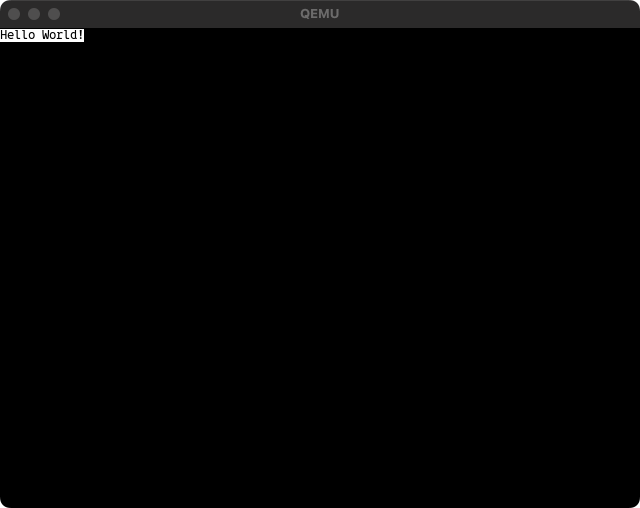

# Render a text

Methods that do not use BIOS interrupts, and when transitioning to 32-bit mode, BIOS interrupts become unavailable.
In such cases, a rasterized font is used. The PHP-OS provides services to handle this easily.

```php
<?php

use PHPOS\OS\CodeInfo;

require __DIR__ . '/vendor/autoload.php';

//
// Create kernel -----------------------------------------------------------------------------
//

$kernel = new \PHPOS\OS\Code(
    new \PHPOS\Architecture\Architecture(
        // Use x86_64 architecture
        \PHPOS\Architecture\ArchitectureType::x86_64,
    ),
);

$kernel
    // Set code name
    ->setName('kernel')

    // Set 16 bit real mode
    ->setBits(\PHPOS\OS\BitType::BIT_16)

    // Set kernel origin
    ->setOrigin(0x1000)

    // Set compiled kernel size (floor(filesize / 512))
    ->setSectors(floor(CodeInfo::CODE_BLOCK_SIZE_BITS_16 / \PHPOS\OS\OSInfo::PAGE_SIZE))

    // Enable A20 Line
    ->registerService(\PHPOS\Service\BIOS\EnableA20Line::class)

    ->registerService(\PHPOS\Service\BIOS\Standard\Segment\SetupSegments::class)
    ->registerService(\PHPOS\Service\BIOS\VESABIOSExtension\SetVESABIOSExtension::class)
    ->registerService(\PHPOS\Service\BIOS\VESABIOSExtension\SetVESABIOSExtensionInformation::class)

    ->registerService(\PHPOS\Service\BIOS\VESABIOSExtension\LoadVESAVideoAddress::class)
    ->registerService(
        \PHPOS\Service\BIOS\VESABIOSExtension\Renderer\RenderText::class,
        new \PHPOS\Service\Component\Text\Font(
            // Rendering text
            'Hello World!',

            // Font path
            '/path/to/your-fonts.ttf',

            // Font size
            12,
        ),
    )

    // Write code signature
    ->registerPostService(\PHPOS\Service\BIOS\Disk\CodeSignature::class);

//
// Create bootloader --------------------------------------------------------------------------
//

$bootloader = new \PHPOS\OS\Code(
    new \PHPOS\Architecture\Architecture(
        // Use x86_64 architecture
        \PHPOS\Architecture\ArchitectureType::x86_64,
    ),
);

// Initialize bootloader
$bootloader
    // Set code name
    ->setName('bootloader')

    // Set 16 bit real mode
    ->setBits(\PHPOS\OS\BitType::BIT_16)

    // Set bootloader origin
    ->setOrigin(\PHPOS\OS\OSInfo::MBR)

    // Setup segments (initialize registers for assembly)
    ->registerService(\PHPOS\Service\BIOS\Standard\Segment\SetupSegments::class)

    // Add loading something sector codes
    ->registerService(\PHPOS\Service\BIOS\System\CallCode::class, $kernel)

    // Add bootloader signature
    ->registerPostService(\PHPOS\Service\BIOS\Bootloader\BootloaderSignature::class);

// Bundle each codes into an OS image
$bundler = new \PHPOS\OS\Bundler\Bundler(
    new \PHPOS\OS\ConfigureOption(
        __DIR__ . '/dist',
        'php-os.img',
        $bootloader,
        [
            $kernel,
        ],
    ),
);

// Distribute Makefile and assembly into `dist` directory by the ConfigureOption
$bundler->distribute();
```

## Generated `bootloader.asm`

- See: [Call code in something sector](../01-call-code-in-something-sector/README.md)

## Generated `kernel.asm`

```asm
;
;   _______  ____  ____  _______            ___     ______
;  |_   __ \|_   ||   _||_   __ \         .'   `. .' ____ \
;    | |__) | | |__| |    | |__) |______ /  .-.  \| (___ \_|
;    |  ___/  |  __  |    |  ___/|______|| |   | | _.____`.
;   _| |_    _| |  | |_  _| |_           \  `-'  /| \____) |
;  |_____|  |____||____||_____|           `.___.'  \______.'
;
; Notice: This file is automatically generated by PHP-OS.
;         Do not edit this file. We cannot be held responsible if this is edited and overwritten again.
;


resb_PHPOS_Service_BIOS_VESABIOSExtension_SetVESABIOSExtensionInformation: resb 256
[bits 16]

[org 0x1000]

cli
in al, 146
or al, 2
out 146, al

cli
xor ax, ax
xor bx, bx
mov ds, ax
mov es, ax
mov ss, ax
mov sp, 4096
sti

__php_PHPOS_Service_BIOS_VESABIOSExtension_SetVESABIOSExtension:
  mov eax, 20226
  mov ebx, 16658
  int 16
  __php_PHPOS_Service_BIOS_VESABIOSExtension_SetVESABIOSExtension_PHPOS_Service_BIOS_VESABIOSExtension_SetVESABIOSExtensionError:
    cmp eax, 79
    je __php_PHPOS_Service_BIOS_VESABIOSExtension_SetVESABIOSExtension_PHPOS_Service_BIOS_VESABIOSExtension_SetVESABIOSExtensionError_success
    mov esi, __php_var_Q291bGQgbm90IHNldCBWRVNBIG1vZGUh
    call __php_PHPOS_Service_BIOS_VESABIOSExtension_SetVESABIOSExtension_PHPOS_Service_BIOS_VESABIOSExtension_SetVESABIOSExtensionError_PHPOS_Service_BIOS_IO_PrintConstantString
    jmp __php_PHPOS_Service_BIOS_VESABIOSExtension_SetVESABIOSExtension_PHPOS_Service_BIOS_VESABIOSExtension_SetVESABIOSExtensionError_PHPOS_Service_BIOS_IO_PrintConstantString_PHPOS_Service_BIOS_IO_PrintConstantString_PrintDone
    __php_PHPOS_Service_BIOS_VESABIOSExtension_SetVESABIOSExtension_PHPOS_Service_BIOS_VESABIOSExtension_SetVESABIOSExtensionError_PHPOS_Service_BIOS_IO_PrintConstantString_PHPOS_Service_BIOS_IO_PrintConstantString_PrintCharacter:
      mov ah, 14
      mov ebx, 15
      int 16
      ret
    __php_PHPOS_Service_BIOS_VESABIOSExtension_SetVESABIOSExtension_PHPOS_Service_BIOS_VESABIOSExtension_SetVESABIOSExtensionError_PHPOS_Service_BIOS_IO_PrintConstantString:
      lodsb
      or al, al
      jz __php_PHPOS_Service_BIOS_VESABIOSExtension_SetVESABIOSExtension_PHPOS_Service_BIOS_VESABIOSExtension_SetVESABIOSExtensionError_PHPOS_Service_BIOS_IO_PrintConstantString_PHPOS_Service_BIOS_IO_PrintConstantString_PrintDone
      call __php_PHPOS_Service_BIOS_VESABIOSExtension_SetVESABIOSExtension_PHPOS_Service_BIOS_VESABIOSExtension_SetVESABIOSExtensionError_PHPOS_Service_BIOS_IO_PrintConstantString_PHPOS_Service_BIOS_IO_PrintConstantString_PrintCharacter
      jmp __php_PHPOS_Service_BIOS_VESABIOSExtension_SetVESABIOSExtension_PHPOS_Service_BIOS_VESABIOSExtension_SetVESABIOSExtensionError_PHPOS_Service_BIOS_IO_PrintConstantString
    __php_PHPOS_Service_BIOS_VESABIOSExtension_SetVESABIOSExtension_PHPOS_Service_BIOS_VESABIOSExtension_SetVESABIOSExtensionError_PHPOS_Service_BIOS_IO_PrintConstantString_PHPOS_Service_BIOS_IO_PrintConstantString_PrintDone:
      ret
    hlt
    __php_PHPOS_Service_BIOS_VESABIOSExtension_SetVESABIOSExtension_PHPOS_Service_BIOS_VESABIOSExtension_SetVESABIOSExtensionError_success:

__php_PHPOS_Service_BIOS_VESABIOSExtension_SetVESABIOSExtensionInformation:
  mov eax, 20225
  mov ecx, 16658
  mov edi, resb_PHPOS_Service_BIOS_VESABIOSExtension_SetVESABIOSExtensionInformation
  int 16

__php_PHPOS_Service_BIOS_VESABIOSExtension_LoadVESAVideoAddress:
  mov eax, [resb_PHPOS_Service_BIOS_VESABIOSExtension_SetVESABIOSExtensionInformation + 40]
  mov edi, eax

__php_PHPOS_Service_BIOS_VESABIOSExtension_Renderer_RenderText:
  mov esi, __php_var___php_PHPOS_Service_BIOS_VESABIOSExtension_Renderer_RenderText_image
  __php_PHPOS_Service_BIOS_VESABIOSExtension_Renderer_RenderText_PHPOS_Service_BIOS_VESABIOSExtension_Renderer_RenderImage_PHPOS_Service_BIOS_VESABIOSExtension_Renderer_Renderer:
    mov ecx, 14
  __php_PHPOS_Service_BIOS_VESABIOSExtension_Renderer_RenderText_PHPOS_Service_BIOS_VESABIOSExtension_Renderer_RenderImage_PHPOS_Service_BIOS_VESABIOSExtension_Renderer_Renderer_outer:
    push ecx
    mov ecx, 84
  __php_PHPOS_Service_BIOS_VESABIOSExtension_Renderer_RenderText_PHPOS_Service_BIOS_VESABIOSExtension_Renderer_RenderImage_PHPOS_Service_BIOS_VESABIOSExtension_Renderer_Renderer_inner:
    __php_PHPOS_Service_BIOS_VESABIOSExtension_Renderer_RenderText_PHPOS_Service_BIOS_VESABIOSExtension_Renderer_RenderImage_PHPOS_Service_BIOS_VESABIOSExtension_Renderer_Renderer_inner_code:
      __php_PHPOS_Service_BIOS_VESABIOSExtension_Renderer_RenderText_PHPOS_Service_BIOS_VESABIOSExtension_Renderer_RenderImage_PHPOS_Service_BIOS_VESABIOSExtension_Renderer_RenderPixel:
        push ecx
        mov ecx, 3
        __php_PHPOS_Service_BIOS_VESABIOSExtension_Renderer_RenderText_PHPOS_Service_BIOS_VESABIOSExtension_Renderer_RenderImage_PHPOS_Service_BIOS_VESABIOSExtension_Renderer_RenderPixel_code:
          __php_PHPOS_Service_BIOS_VESABIOSExtension_Renderer_RenderText_PHPOS_Service_BIOS_VESABIOSExtension_Renderer_RenderImage_copy_pixel_from_destination:
            lodsb
            mov [edi], al
            inc edi
            loop __php_PHPOS_Service_BIOS_VESABIOSExtension_Renderer_RenderText_PHPOS_Service_BIOS_VESABIOSExtension_Renderer_RenderImage_copy_pixel_from_destination
        pop ecx
    loop __php_PHPOS_Service_BIOS_VESABIOSExtension_Renderer_RenderText_PHPOS_Service_BIOS_VESABIOSExtension_Renderer_RenderImage_PHPOS_Service_BIOS_VESABIOSExtension_Renderer_Renderer_inner
    pop ecx
    add edi, 1668
  loop __php_PHPOS_Service_BIOS_VESABIOSExtension_Renderer_RenderText_PHPOS_Service_BIOS_VESABIOSExtension_Renderer_RenderImage_PHPOS_Service_BIOS_VESABIOSExtension_Renderer_Renderer_outer

__php_var_Q291bGQgbm90IHNldCBWRVNBIG1vZGUh:
  db "Could not set VESA mode!", 0

__php_var___php_PHPOS_Service_BIOS_VESABIOSExtension_Renderer_RenderText_image:
  db 255, 255, 255, 255, 255, 255, 255, 255, 255, 255, 255, 255, 255, 255, 255, 255, 255, 255, 255, 255, 255, 255, 255, 255, 255, 255, 255, 255, 255, 255, 255, 255, 255, 255, 255, 255, 255, 255, 255, 255, 255, 255, 255, 255, 255, 255, 255, 255
  db 255, 255, 255, 255, 255, 255, 255, 255, 255, 255, 255, 255, 255, 255, 255, 255, 255, 255, 255, 255, 255, 255, 255, 255, 255, 255, 255, 255, 255, 255, 255, 255, 255, 255, 255, 255, 255, 255, 255, 255, 255, 255, 255, 255, 255, 255, 255, 255
  ; ... omitted

times 31744-($-$$) db 0


```

### Screenshot

<p align="center">
  
</p>
