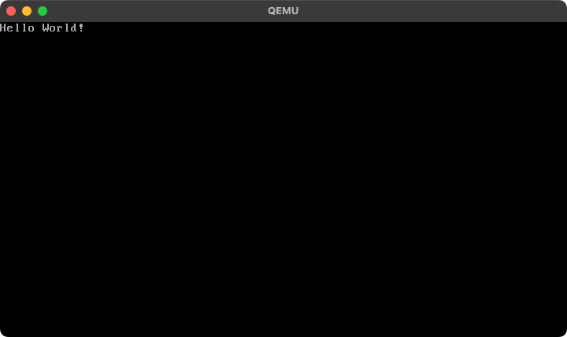

# Enable Text Mode
The PHP-OS is designed to be as simple as possible, but VESA is somewhat complex for outputting regular text. Therefore, a text mode can be executed for easily outputting text and for displaying initial processing logs while BIOS interrupts are enabled.

```php
<?php
$bootloader = new \PHPOS\OS\Code(
    new \PHPOS\Architecture\Architecture(
        // Use x86_64 architecture
        \PHPOS\Architecture\ArchitectureType::x86_64,
    ),
);

// Initialize bootloader
$bootloader
    // Set code name
    ->setName('bootloader')

    // Set 16 bit real mode
    ->setBits(\PHPOS\OS\BitType::BIT_16)

    // Set bootloader origin
    ->setOrigin(\PHPOS\OS\OSInfo::MBR)

    // Setup segments (initialize registers for assembly)
    ->registerService(\PHPOS\Service\BIOS\Standard\Segment\SetupSegments::class)

    // Enable Text Mode
    ->registerService(\PHPOS\Service\BIOS\VESABIOSExtension\TextMode::class)

    // Print Hello World!
    ->registerService(\PHPOS\Service\BIOS\IO\PrintConstantString::class, 'Hello World!')

    // Add bootloader signature
    ->registerPostService(\PHPOS\Service\BIOS\Bootloader\BootloaderSignature::class);

// Bundle each codes into an OS image
$bundler = new \PHPOS\OS\Bundler\Bundler(
    new \PHPOS\OS\ConfigureOption(
        __DIR__ . '/dist',
        'php-os.img',
        $bootloader,
        [
            $kernel,
        ],
    ),
);

// Distribute Makefile and assembly into `dist` directory by the ConfigureOption
$bundler->distribute();

```

### Screenshot

<p align="center">
  
</p>
