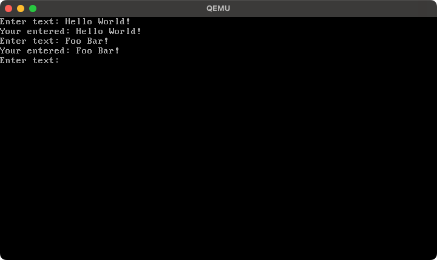

# Capture inputting keys
This is an example that displays the entered text using BIOS interrupts.
This is only possible in 16-bit real mode. Other methods are required in 32-bit protected mode, such as receiving input via PS/2 or USB.

```php

<?php
$bootloader = new \PHPOS\OS\Code(
    new \PHPOS\Architecture\Architecture(
        // Use x86_64 architecture
        \PHPOS\Architecture\ArchitectureType::x86_64,
    ),
);

// Initialize bootloader
$bootloader
    // Set code name
    ->setName('bootloader')

    // Set 16 bit real mode
    ->setBits(\PHPOS\OS\BitType::BIT_16)

    // Set bootloader origin
    ->setOrigin(\PHPOS\OS\OSInfo::MBR)

    // Setup segments (initialize registers for assembly)
    ->registerService(\PHPOS\Service\BIOS\Standard\Segment\SetupSegments::class)

    // Enable Text Mode
    ->registerService(\PHPOS\Service\BIOS\VESABIOSExtension\TextMode::class)

    // Print inputted text
    ->registerService(\PHPOS\Service\Kit\Startup\PrintInputtedText::class)

    // Add bootloader signature
    ->registerPostService(\PHPOS\Service\BIOS\Bootloader\BootloaderSignature::class);

// Bundle each codes into an OS image
$bundler = new \PHPOS\OS\Bundler\Bundler(
    new \PHPOS\OS\ConfigureOption(
        __DIR__ . '/dist',
        'php-os.img',
        $bootloader,
        [
            $kernel,
        ],
    ),
);

// Distribute Makefile and assembly into `dist` directory by the ConfigureOption
$bundler->distribute();
```


### Screenshot

<p align="center">
  
</p>
